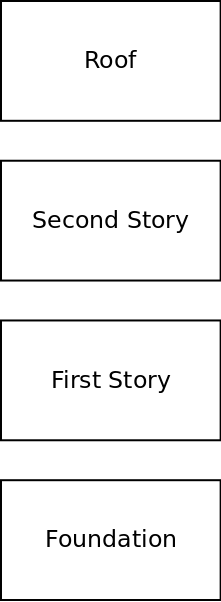
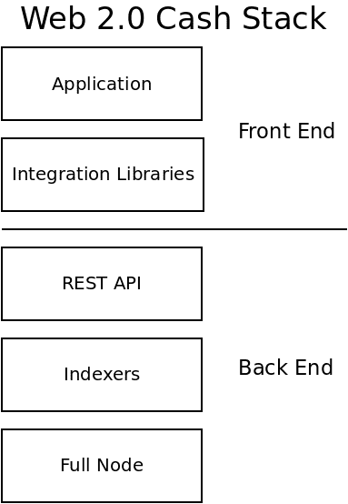
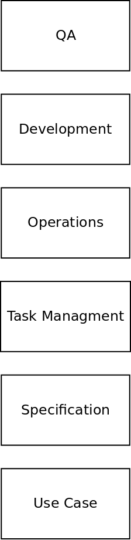

This article doesn't discuss programming languages or frameworks. The context of this article covers the *workflow* and *management* of building an app. This is based on my experience building both open and closed source apps.

## The Layered Model

Anyone who has read [CashStack.info](https://cashstack.info) is familiar with my approach to layered architecture. This mental model applies to many areas of life. Take for instance, the construction of a house:

Each layer supports the layer above it. In the Cash Stack, the app at the top is supported by the 'foundation' of the blockchain:

## Applying Layers to App Management

Because layered approaches are so useful, they are my go-to mental framework for trying to understanding complex systems. The management of app development is a complex system, and I've been thinking about how to represent it in layers. Here is what I've come up with:

### Use Case
At the base of the stack is the Use Case. The use case is a simple document that answers the following questions:

- What is the problem your app solves?
- Who is the target user for your app?
- Describe the 'happy path'. This is the the navigational path and clicks your ideal user takes from start to finish, using the path of least resistance.

Defining the the Use Case is incredibly important. It is the conceptual 'foundation' upon which the rest of the application is built. This is not a technical document. It's a high-level document that is used by management and technical people to collaborate.

- For management, the Use Case document describes (in plain English) the high level concepts.
- For the technical team, the Use Case dictates the trade-offs that need to be taken when choosing between different technical options, in order to achieve the high level goals described in the Use Case document.

### The Specification
The next layer for effectively managing app development is the Specification. This starts as a single document, but it will usually grow into a collection of documents. The Specification is a plain-English description of all the details of the app. Whereas the Use Case document strives to be high-level, the Specification contains low-level technical details.

Another difference is that the Use Case document is created by management and should not change much with time. If it does, that's the same thing as 'moving the goal posts'. The Use Case is the target that you're trying to hit by executing the [software development process](/blog/software-development-process). In contrast, the Specification is a living document. It should be updated every week.

Because the Specification is a technical document, it should be formatted using headings, bullet points, and have a table of contents at the top of each document. It should be easy to navigate. This is a reference document that many people will refer to while building the app. I've found it best to write the Specification in Markdown, and keep it in the same code repository with the app. That way the same version-control tools can be applied to the Specification.

At the base of each section describing a major feature, there should be a section entitled *Implementation Status*. This section should be updated on a weekly basis. Whereas the rest of the Specification document describes how the app **should** work, the Implemtation Status section captures how the app **currently** works. This section is one of the primary communication tools between the Product Owner (management & money) and the technical team. The technical lead should update these sections each week before the team meeting. The technical team should review these changes at each weekly meeting.

## Task Management
Task management is concerned with the day-to-day management of the team. The details are captured in the video below, which I've included in previous blog posts.

<iframe width="560" height="315" src="https://www.youtube.com/embed/YHngWbJ4Cjw" frameborder="0" allow="accelerometer; autoplay; clipboard-write; encrypted-media; gyroscope; picture-in-picture" allowfullscreen></iframe>

At the end of the task-management process, there is a 'Done' column. That is where the Task Management layer connects to the Specification layer. When tasks in the 'Done' column are archived, that is the opportunity to update the Implementation Status sections in the Specification document.

That makes sense if you think about it: Tasks are completed in an effort to move the app towards the goals described in the Specification document. Tasks are organized in Sprints, which typically last a week or two. The Specification should be updated at the end of each Sprint, to capture the progress.

## Operations
The term 'Operations' is synonymous with 'Dev Ops' or 'Infrastructure'. These are the physical computers, domain names, network settings, and open source software that allows things to work. If this infrastructure is not fully functional, it does not matter how beautiful the app is. This is why operations must take priority over Development or QA.

Someone on the team needs to take responsibility for these Dev Ops. It's an important job, and if you do it right, no one will thank you, because everything will 'just work'.

This is a difficult part of the app to manage, because it's easy to forget about... until things break. Scheduling maintenance on a calendar is the best way to manage these tasks. The team should set regular reminders to do pro-active maintenance on any existing infrastructure that they depend on.

## Development
Development is the process described in [this previous blog post](/blog/software-development-process). While this section is managed through Task Management, it is executed by following the path described in that blog post.

## QA
Quality Assurance (QA) is a continuous on-going effort. It's never 'done'. It's also not appropriate to worry about, until the [Development process](/blog/software-development-process) has code in production. There are many steps of development that need to take place before it's appropriate to start worrying about QA.

From a technical standpoint, managing QA comes back to managing the Specification document. As new Use Cases are developed, new code will be written, and Specification documents will be updated. QA is the process of ensuring the code running in Production meets the goals described in the Specification Document.

There are other aspects of QA that are non-technical: interfacing with users and discovering new pain points. But that is largely outside the scope of the process described here.
